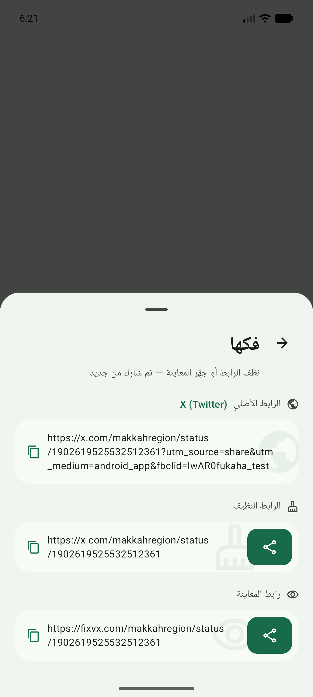
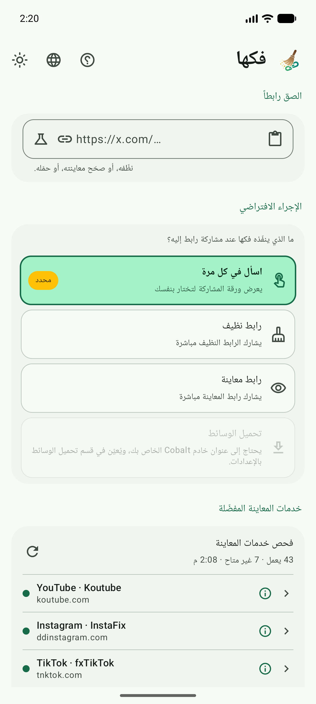
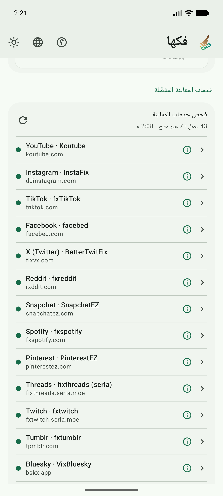
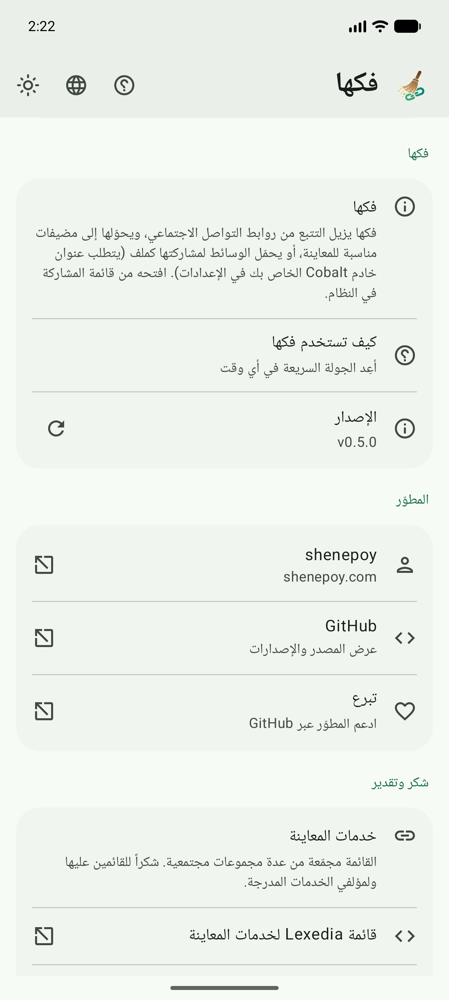
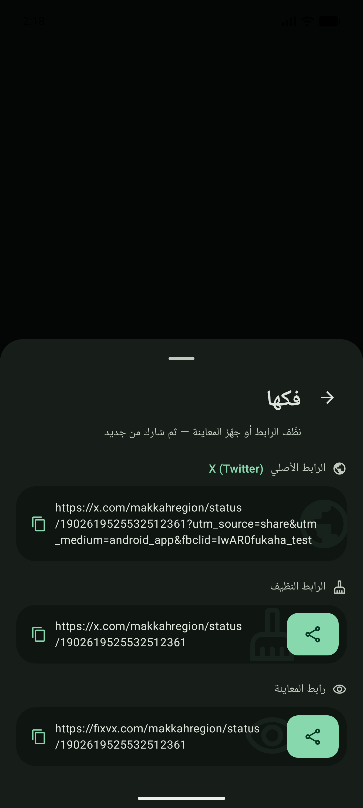
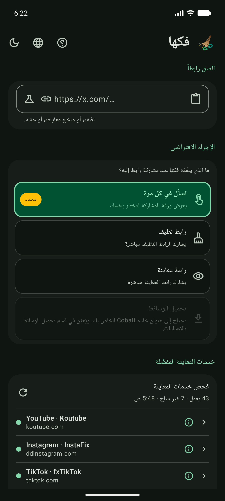
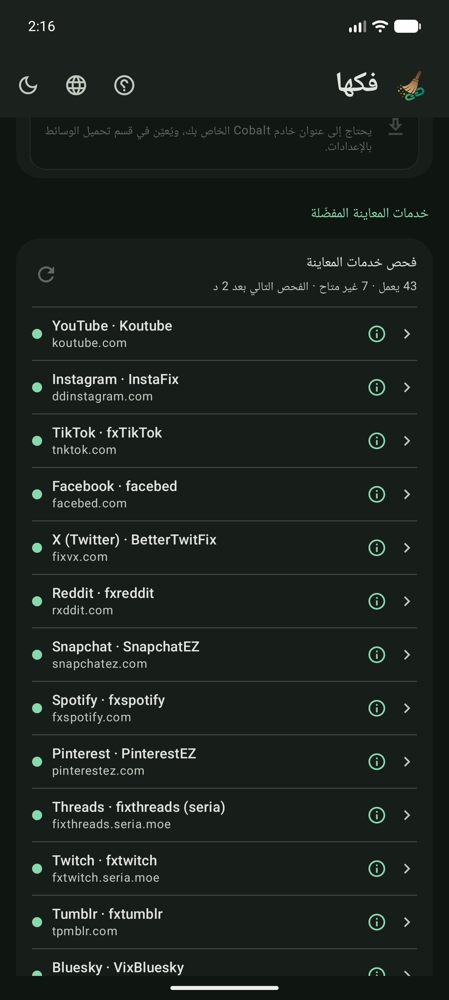
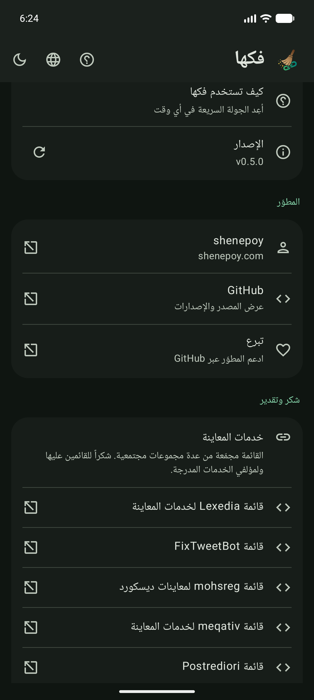

<!-- markdownlint-disable MD033 MD060 -->

<div dir="rtl" lang="ar">

<p align="center">
  
</p>

<h1 align="center">فكها — Fukaha</h1>

<p align="center">
  <strong>فكّ الروابط من التتبع. شاركها نظيفة.</strong><br/>
  من قائمة المشاركة في النظام — يزيل التتبع، ويحوّل الرابط إلى مضيف مناسب للمعاينة،<br/>
  أو يحمّل الوسائط ويشاركها كملف.<br/>
  <span dir="ltr">Kotlin Multiplatform</span> · أندرويد (+ iOS قيد الإعداد).
</p>

<p align="center">
  <a href="https://github.com/Zyzto/Fukaha/releases/latest"></a>
  <a href="https://github.com/Zyzto/Fukaha"></a>
  <a href="https://apps.obtainium.imranr.dev/redirect.html?r=obtainium://add/https://github.com/Zyzto/Fukaha/releases"></a>
  
  
  
</p>

<p align="center">
  <a href="https://github.com/Zyzto/Fukaha/releases/latest"><strong>آخر إصدار</strong></a>
  ·
  <a href="https://fukaha.shenepoy.com"><strong>تطبيق الويب</strong></a>
  ·
  <a href="#ماذا-تقدّم">ماذا تقدّم؟</a>
  ·
  <a href="#لقطات">لقطات</a>
  ·
  <a href="#التثبيت">التثبيت</a>
  ·
  <a href="#التطوير">التطوير</a>
  <br/>
  <a href="README.md"><span dir="ltr">English</span></a>
</p>

<p align="center">
  الاسم من العربية: <strong>فكها</strong>
  (<span dir="ltr"><em>fakkahā</em></span>) — فكّ / إزالة التتبع والزوائد عن الرابط.<br/>
  والاسم اللاتيني <span dir="ltr"><strong>Fukaha</strong></span> مأخوذ منه.
</p>

</div>

---

<div dir="rtl" lang="ar">

## ماذا تقدّم؟

| | |
|---|---|
| **قائمة المشاركة** | تظهر في قائمة المشاركة على أندرويد للروابط والنص — ورقة سريعة، وليست تطبيقاً للتصفح. |
| **رابط نظيف** | يزيل `utm_*` و`fbclid` و`igshid` وأشباهها، وينظّم اسم المضيف. |
| **رابط معاينة** | يحوّله إلى خدمات مثل fixvx وddinstagram وfxTikTok من عدة مجموعات مجتمعية لقوائم خدمات المعاينة. |
| **ملف وسائط** | تحميل اختياري عبر خادم Cobalt الخاص بك، ثم مشاركة الملف. |
| **الإعدادات** | الإجراء الافتراضي، خدمة المعاينة لكل منصة، Cobalt، الروابط المختصرة، العربية والإنجليزية، السمة، البحث عن تحديثات. |
| **خفيف** | بلا مزامنة في الخلفية وبلا حسابات — الشبكة عند المشاركة فقط. |
| **تطبيق ويب** | النواة نفسها على [fukaha.shenepoy.com](https://fukaha.shenepoy.com) — قابل للتثبيت، يعمل دون اتصال، وينضم إلى قائمة المشاركة في أندرويد بعد تثبيته. |

**عند المشاركة إلى فكها**

| الخيار | السلوك |
|--------|--------|
| **اسأل في كل مرة** | يعرض الورقة (تنظيف / معاينة / تحميل / نسخ). |
| **رابط نظيف / معاينة / تحميل** | ينفّذ فوراً ثم يفتح مشاركة النظام. |

</div>

---

<div dir="rtl" lang="ar">

## لقطات

<div dir="ltr">
<p align="center">
  
  
  
  
</p>
</div>

<details>
<summary>السمة الداكنة</summary>
<div dir="ltr">
<p align="center">
  
  
  
  
</p>
</div>
</details>

</div>

---

<div dir="rtl" lang="ar">

## التثبيت

### أندرويد

| الخيار | |
|--------|--|
| **Obtainium** (موصى به) | [](https://apps.obtainium.imranr.dev/redirect.html?r=obtainium://add/https://github.com/Zyzto/Fukaha/releases) — يتابع [إصدارات GitHub](https://github.com/Zyzto/Fukaha/releases). الإصدارات قبل **v0.4.2** استخدمت مفتاح تصحيح مؤقتاً؛ أزل التطبيق مرة ثم ثبّت 0.4.2 أو أحدث. التحديثات التالية تبقى بنفس التوقيع. |
| **APK** | حمّل من [آخر إصدار](https://github.com/Zyzto/Fukaha/releases/latest) |

### iOS

ليس على المتجر بعد. التكامل المستمر يبني تطبيقاً للمحاكي بلا توقيع (لا يلزم حساب مطوّر مدفوع). للتشغيل محلياً أو للنشر لاحقاً بحساب مدفوع انظر [iosApp/README.md](iosApp/README.md).

### الويب (PWA)

**[fukaha.shenepoy.com](https://fukaha.shenepoy.com)** — قابل للتثبيت، يعمل دون اتصال، وبلا حساب.

بعد تثبيته ينضم فكها إلى قائمة المشاركة في النظام كما يفعل التطبيق، وهذا متاح في **متصفحات Chromium على أندرويد فقط**: لا يدعم iOS مشاركة الويب في أي إصدار، فيبقى على iPhone «إضافة إلى الشاشة الرئيسية» مع لصق الرابط.

ويعمل فحص توفّر خدمات المعاينة هنا أيضاً، ويُشغَّل يدوياً من الإعدادات. يستخدم فحص أندرويد رموز حالة HTTP ومجموعة طلبات محدودة، أما المتصفح فمقيّد أكثر لأن CORS يمنعه من قراءة رد الموقع الآخر: ينجح طلب `no-cors` مع أي رمز حالة ويفشل فقط عند خلل في الشبكة، لذلك لا تكشف نتائج المتصفح رموز 404 بشكل موثوق. أما تتبّع الروابط المختصرة وتحميل الوسائط فيبقيان في التطبيق وحده، لأن تتبّع التحويل يعني قراءة رد لا يسمح المتصفح بقراءته.

</div>

---

<div dir="rtl" lang="ar">

## التطوير

**المتطلبات:** JDK 17 · Android SDK 37 · جهاز/محاكي (minSdk 26)

```bash
export ANDROID_HOME=~/Android/Sdk
./gradlew :shared:testAndroidHostTest
./gradlew :composeApp:assembleDebug
adb install -r composeApp/build/outputs/apk/debug/composeApp-debug.apk
```

افتح **فكها** للإعدادات، أو شارك أي رابط من منصات التواصل الاجتماعي إليه من تطبيق آخر.

**الويب:** الأمر `./gradlew :webApp:jsBrowserDevelopmentRun --continuous` يشغّل التطبيق على `localhost:8080` ويعيد بناءه عند كل حفظ. لا يُسجَّل عامل الخدمة على localhost حتى لا يصطدم التطوير بذاكرة تخزين قديمة. والأمر `./gradlew :webApp:jsBrowserDistribution` ينتج الملفات الجاهزة للنشر في `webApp/build/dist/js/productionExecutable`. الأيقونات محفوظة في المستودع، ويعيد `webApp/scripts/generate-icons.sh` توليدها من الشعار (يحتاج `rsvg-convert`).

**تحميل الوسائط:** ضع عنوان خادم Cobalt الذي تستضيفه بنفسك في قسم تحميل الوسائط القابل للطي بالإعدادات (مطوي افتراضياً)، ومفتاحاً إن لزم. لا يوجد عنوان عام جاهز — واجهة `cobalt.tools` العامة لا تعمل مع التطبيق. تبقى خيارات التحميل ظاهرة لكن معطّلة حتى تعيين عنوان `http(s)` صالح.

تتبع الإصدارات تنسيق CalVer على طريقة لمحة: `YY.0M.MICRO` (الإصدار الحالي `26.09.0`). توجد القيمة الأساسية في `VERSION`؛ استخدم `bash scripts/ci/next_version.sh` لحساب الإصدار التالي في الشهر الحالي بتوقيت UTC.

لنشر إصدار:

```bash
git tag v26.09.0
git push origin v26.09.0
```

</div>

---

<div dir="rtl" lang="ar">

## الرخصة

[رخصة غنو أفيرو العمومية الإصدار 3.0](https://www.gnu.org/licenses/agpl-3.0.html) — برمجيات حرة؛ إن عدّلت البرنامج وشغّلته كخدمة شبكية فيجب توفير الشيفرة المصدرية المقابلة.  
النص الكامل: [LICENSE](LICENSE).

قائمة خدمات المعاينة مأخوذة من عدة مجموعات مجتمعية، منها [Lexedia](https://gist.github.com/Lexedia/bbbde4dbbf628b0bfe8476a96a977a8f) و[FixTweetBot](https://github.com/Kyrela/FixTweetBot#awesome-fixers) و[mohsreg](https://gist.github.com/mohsreg/927bf8b2092515ee1a8ee88c3e4d2c14) و[meqativ](https://gist.github.com/meqativ/ea15d319f7889a02c893605c62f148c2) و[Postrediori](https://gist.github.com/Postrediori/cc52b0ca054179a91aab2e63582265b6) و[EmbedFixer](https://github.com/k33bs/EmbedFixer)، بالإضافة إلى مؤلفي الخدمات المدرجة.

</div>

<p align="center">
  من إعداد <a href="https://shenepoy.com"><strong>shenepoy</strong></a>
  ·
  <a href="https://github.com/Zyzto">GitHub</a>
</p>
