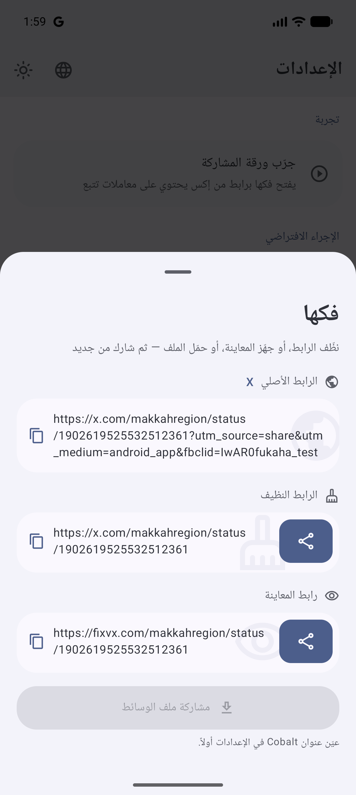
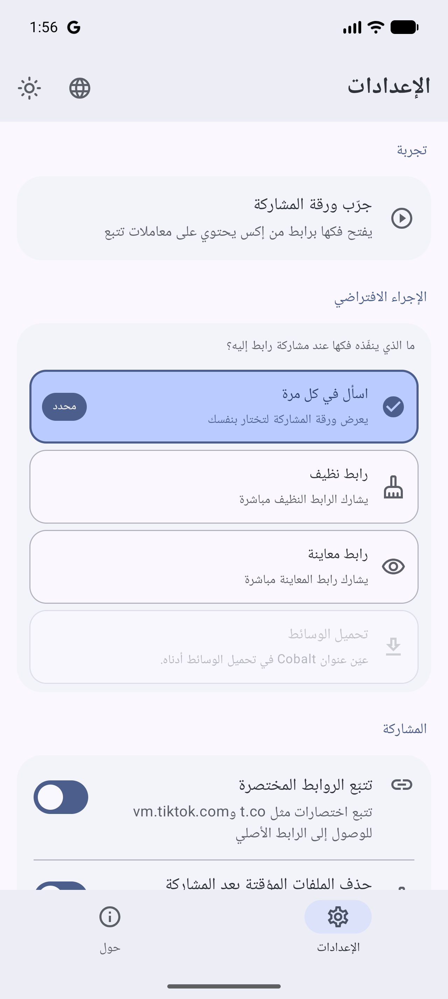
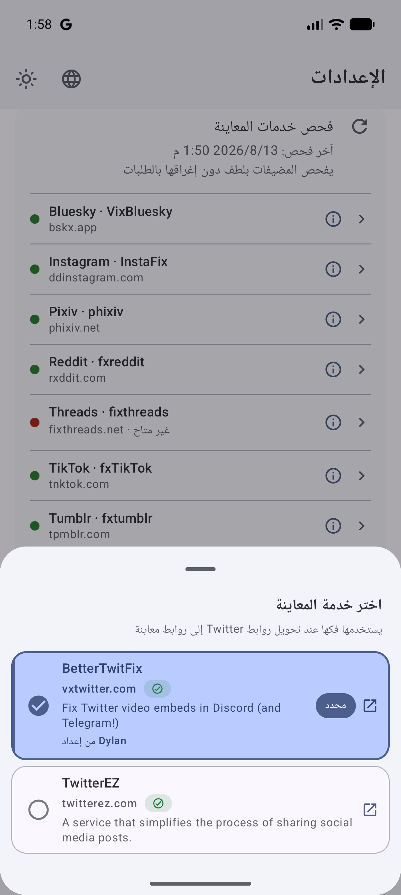
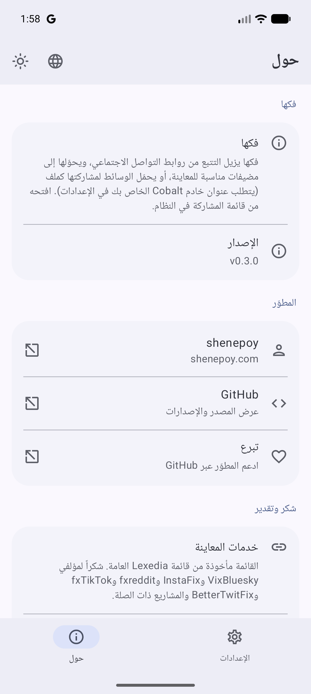
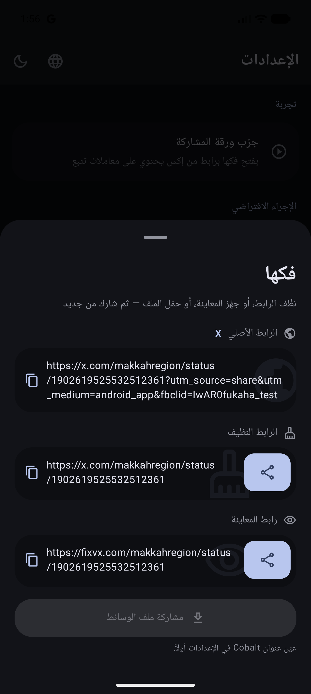
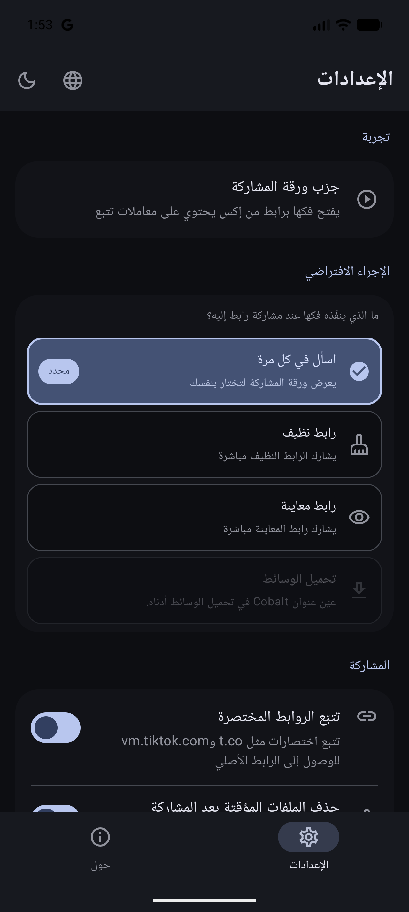
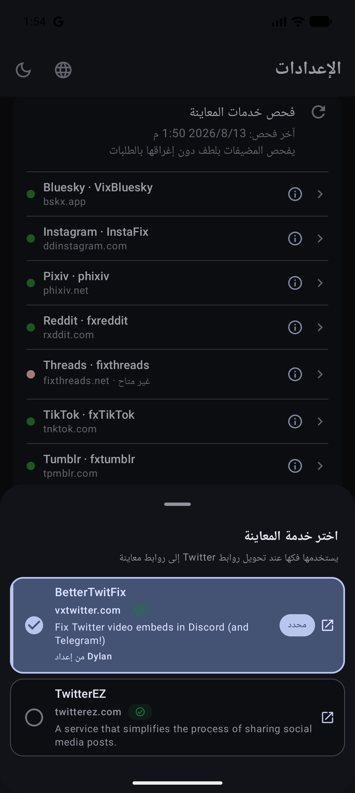
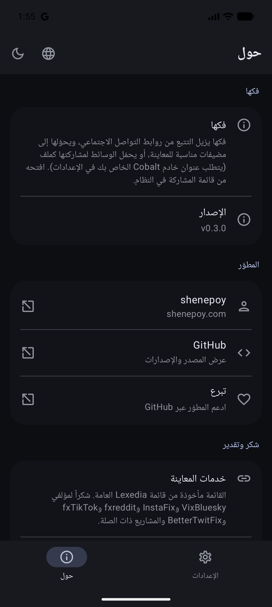

<!-- markdownlint-disable MD033 MD060 -->

<div dir="rtl" lang="ar">

<p align="center">
  
</p>

<h1 align="center">فكها — Fukaha</h1>

<p align="center">
  <strong>فكّ الروابط من التتبع. شاركها نظيفة.</strong><br/>
  من قائمة المشاركة في النظام — يزيل التتبع، ويحوّل الرابط إلى مضيف مناسب للمعاينة،<br/>
  أو يحمّل الوسائط ويشاركها كملف.<br/>
  <span dir="ltr">Kotlin Multiplatform</span> · أندرويد (+ iOS قيد الإعداد).
</p>

<p align="center">
  <a href="https://github.com/Zyzto/Fukaha/releases/latest"></a>
  <a href="https://github.com/Zyzto/Fukaha"></a>
  <a href="https://apps.obtainium.imranr.dev/redirect.html?r=obtainium://add/https://github.com/Zyzto/Fukaha/releases"></a>
  
  
  
</p>

<p align="center">
  <a href="https://github.com/Zyzto/Fukaha/releases/latest"><strong>آخر إصدار</strong></a>
  ·
  <a href="#ماذا-تقدّم">ماذا تقدّم؟</a>
  ·
  <a href="#لقطات">لقطات</a>
  ·
  <a href="#التثبيت">التثبيت</a>
  ·
  <a href="#التطوير">التطوير</a>
  <br/>
  <a href="README.md"><span dir="ltr">English</span></a>
</p>

<p align="center">
  الاسم من العربية: <strong>فكها</strong>
  (<span dir="ltr"><em>fakkahā</em></span>) — فكّ / إزالة التتبع والزوائد عن الرابط.<br/>
  والاسم اللاتيني <span dir="ltr"><strong>Fukaha</strong></span> مأخوذ منه.
</p>

</div>

---

<div dir="rtl" lang="ar">

## ماذا تقدّم؟

| | |
|---|---|
| **قائمة المشاركة** | تظهر في قائمة المشاركة على أندرويد للروابط والنص — ورقة سريعة، وليست تطبيقاً للتصفح. |
| **رابط نظيف** | يزيل `utm_*` و`fbclid` و`igshid` وأشباهها، وينظّم اسم المضيف. |
| **رابط معاينة** | يحوّله إلى خدمات مثل vxTwitter وddinstagram وfxTikTok من [قائمة Lexedia](https://gist.github.com/Lexedia/bbbde4dbbf628b0bfe8476a96a977a8f). |
| **ملف وسائط** | تحميل اختياري عبر خادم Cobalt الخاص بك، ثم مشاركة الملف. |
| **الإعدادات** | الإجراء الافتراضي، خدمة المعاينة لكل منصة، Cobalt، الروابط المختصرة، العربية والإنجليزية، السمة. |
| **خفيف** | بلا مزامنة في الخلفية وبلا حسابات — الشبكة عند المشاركة فقط. |

**عند المشاركة إلى فكها**

| الخيار | السلوك |
|--------|--------|
| **اسأل في كل مرة** | يعرض الورقة (تنظيف / معاينة / تحميل / نسخ). |
| **رابط نظيف / معاينة / تحميل** | ينفّذ فوراً ثم يفتح مشاركة النظام. |

</div>

---

<div dir="rtl" lang="ar">

## لقطات

<div dir="ltr">
<p align="center">
  
  
  
  
</p>
</div>

<details>
<summary>السمة الداكنة</summary>
<div dir="ltr">
<p align="center">
  
  
  
  
</p>
</div>
</details>

</div>

---

<div dir="rtl" lang="ar">

## التثبيت

### أندرويد

| الخيار | |
|--------|--|
| **Obtainium** (موصى به) | [](https://apps.obtainium.imranr.dev/redirect.html?r=obtainium://add/https://github.com/Zyzto/Fukaha/releases) — يتابع [إصدارات GitHub](https://github.com/Zyzto/Fukaha/releases) |
| **APK** | حمّل من [آخر إصدار](https://github.com/Zyzto/Fukaha/releases/latest) |

### iOS

المصادر تحت `iosApp/` و`iosShareExtension/`. اربط إطار <span dir="ltr">Shared</span> في Xcode — التفاصيل في [iosApp/README.md](iosApp/README.md). لا يتوفر بناء متجر بعد.

</div>

---

<div dir="rtl" lang="ar">

## التطوير

**المتطلبات:** JDK 17 · Android SDK 35 · جهاز/محاكي (minSdk 26)

```bash
export ANDROID_HOME=~/Android/Sdk
./gradlew :shared:testDebugUnitTest
./gradlew :composeApp:assembleDebug
adb install -r composeApp/build/outputs/apk/debug/composeApp-debug.apk
```

افتح **فكها** للإعدادات، أو شارك أي رابط من منصات التواصل الاجتماعي إليه من تطبيق آخر.

**تحميل الوسائط:** ضع عنوان خادم Cobalt الذي تستضيفه بنفسك في قسم تحميل الوسائط القابل للطي بالإعدادات (مطوي افتراضياً)، ومفتاحاً إن لزم. لا يوجد عنوان عام جاهز — واجهة `cobalt.tools` العامة لا تعمل مع التطبيق. تبقى خيارات التحميل ظاهرة لكن معطّلة حتى تعيين عنوان `http(s)` صالح.

</div>

---

<div dir="rtl" lang="ar">

## الرخصة

[CC BY-NC-SA 4.0](https://creativecommons.org/licenses/by-nc-sa/4.0/) — مشاركة وتعديل مع نسب العمل، **لغير التجاري** فقط، وبنفس الرخصة للمشتقات.  
النص الكامل: [LICENSE](LICENSE).

</div>

<p align="center">
  من إعداد <a href="https://shenepoy.com"><strong>shenepoy</strong></a>
  ·
  <a href="https://github.com/Zyzto">GitHub</a>
</p>
