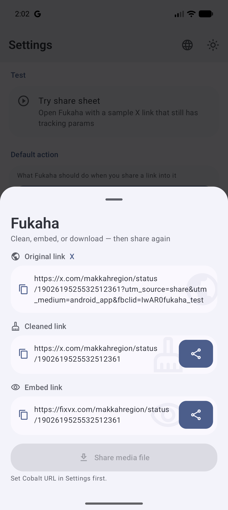
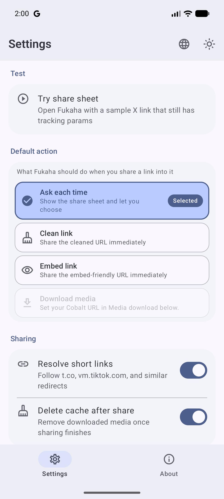
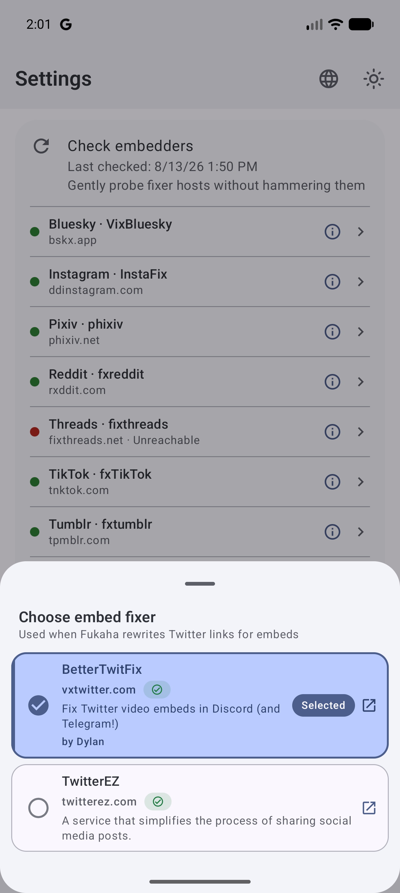
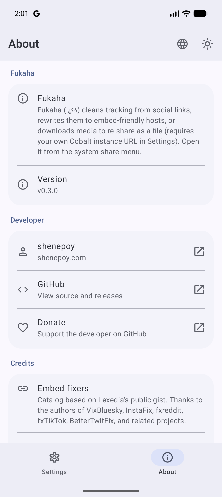
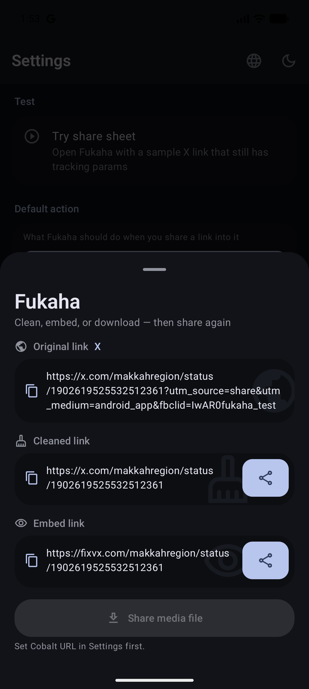
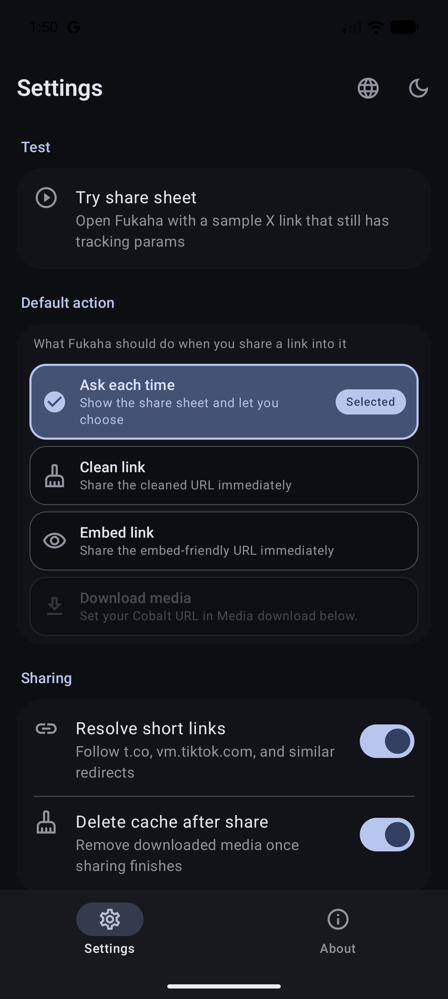
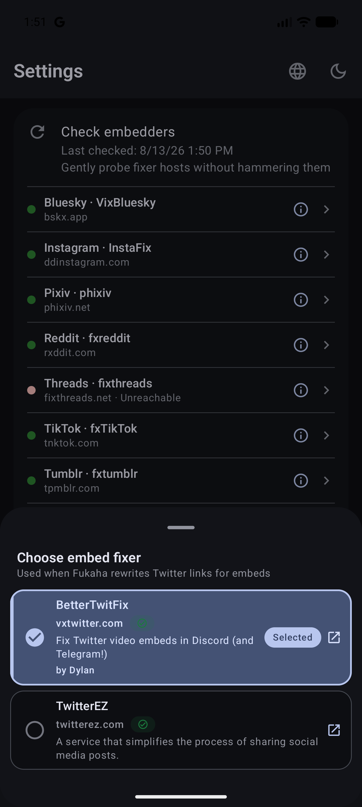
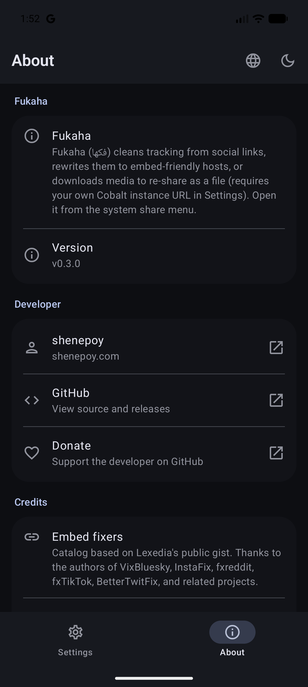

<!-- markdownlint-disable MD033 MD060 -->

<p align="center">
  
</p>

<h1 align="center">Fukaha - فكها</h1>

<p align="center">
  <strong>Untangle social links. Share them clean.</strong><br/>
  From the system share sheet — strip tracking, rewrite to embed-friendly hosts,<br/>
  or download media and share the file. Kotlin Multiplatform · Android (+ iOS WIP).
</p>

<p align="center">
  <a href="https://github.com/Zyzto/Fukaha/releases/latest"></a>
  <a href="https://github.com/Zyzto/Fukaha"></a>
  <a href="https://apps.obtainium.imranr.dev/redirect.html?r=obtainium://add/https://github.com/Zyzto/Fukaha/releases"></a>
  
  
  
</p>

<p align="center">
  <a href="https://github.com/Zyzto/Fukaha/releases/latest"><strong>Latest release</strong></a>
  ·
  <a href="#what-you-get">What you get</a>
  ·
  <a href="#screenshots">Screenshots</a>
  ·
  <a href="#install">Install</a>
  ·
  <a href="#develop">Develop</a>
  ·
  <a href="README.ar.md">العربية</a>
</p>

<p align="center">
  The name <strong>Fukaha</strong> comes from Arabic
  <span dir="rtl"><strong>فكها</strong></span>
  (<em>fakkahā</em>): untangle / unwrap it —
  pulling tracking and clutter off a shared link.
</p>

---

## What you get

| | |
|---|---|
| **Share sheet** | Appears in Android’s system share menu for text/links — overlay sheet, not a full browser app. |
| **Clean link** | Strips `utm_*`, `fbclid`, `igshid`, and similar noise; normalizes hosts. |
| **Embed link** | Rewrites to fixer hosts (fixvx, ddinstagram, fxTikTok, …) from several community collections of embed-fixer lists. |
| **Media file** | Optional download via your own Cobalt instance, then re-share as a file. |
| **Settings** | Default action, per-network fixer, Cobalt URL/key, short-link resolve, EN/AR, theme, update check. |
| **Lite** | No background sync, no accounts — network only when you share. |

**Default actions**

| Action | Behaviour |
|--------|-----------|
| **Ask each time** | Show the sheet (clean / embed / download / copy). |
| **Clean / Embed / Download** | Run immediately, then open the system share chooser. |

---

## Screenshots

<p align="center">
  
  
  
  
</p>

<details>
<summary>Dark theme</summary>
<p align="center">
  
  
  
  
</p>
</details>

---

## Install

### Android

| Option | |
|--------|--|
| **Obtainium** (recommended) | [](https://apps.obtainium.imranr.dev/redirect.html?r=obtainium://add/https://github.com/Zyzto/Fukaha/releases) — tracks [GitHub Releases](https://github.com/Zyzto/Fukaha/releases). Builds before **v0.4.2** used a one-off CI debug key; uninstall once, then install 0.4.2+. Later updates keep the same signature. |
| **APK** | Download from [latest release](https://github.com/Zyzto/Fukaha/releases/latest) |

### iOS

Not on the App Store yet. CI builds an **unsigned Simulator app** (no Apple Developer account required). To run locally or later ship with a paid team, see [iosApp/README.md](iosApp/README.md).

---

## Develop

**Requirements:** JDK 17 · Android SDK 35 · Android device/emulator (minSdk 26). iOS Simulator builds need a Mac + Xcode — see [iosApp/README.md](iosApp/README.md).

```bash
export ANDROID_HOME=~/Android/Sdk   # or your SDK path
./gradlew :shared:testDebugUnitTest
./gradlew :composeApp:assembleDebug
adb install -r composeApp/build/outputs/apk/debug/composeApp-debug.apk
```

Open **Fukaha** for Settings / About, or share any social URL into it from another app.

**Watch install:** with a device or emulator connected, run `./gradlew -t :composeApp:installAndLaunchDebug` (or the Cursor/VS Code task **Android: watch install + launch**). Gradle rebuilds, reinstalls, and relaunches Settings on save. This is not Compose Hot Reload / Live Edit — the app restarts and UI state is not kept.

**Modules**

| Module | Role |
|--------|------|
| `shared` | URL clean, embed catalog, Cobalt download, settings models (Android + iOS) |
| `composeApp` | Android UI — share sheet + Settings/About |
| `iosApp` / `iosShareExtension` | SwiftUI Settings + Share Extension (XcodeGen + Simulator CI) |

**Media download:** set your own self-hosted Cobalt instance URL (and API key if required) under the collapsible Media download section in Settings (collapsed by default). There is no working public default — the public `cobalt.tools` API will not work with this app. Download options stay visible but disabled until a valid `http(s)` instance URL is configured.

---

## Architecture (short)

- **Shared core (KMP)** — parse URL → clean → embed rewrite → optional Cobalt download  
- **Android** — translucent `ShareActivity` + Material 3 Compose Settings  
- **iOS** — Share Extension calling `FukahaIosFacade` + App Group settings  

```text
Share menu → Fukaha → clean | embed | file → system share again
```

---

## CI / CD

| Workflow | Trigger | What it does |
|----------|---------|----------------|
| [CI](.github/workflows/ci.yml) | push / PR to `main`, or manual | Shared unit tests, debug APK, unsigned iOS Simulator app |
| [Release](.github/workflows/release.yml) | tag `v*` / manual | Release APK artifact + GitHub Release |

Tag a release:

```bash
git tag v0.4.4
git push origin v0.4.4
```

---

## Contributing & secrets

This repository is **public**. Never commit keystores, API keys, or `local.properties`. Use Settings in-app for Cobalt credentials.

Release APKs are signed with a keystore stored only in GitHub Actions secrets (`RELEASE_KEYSTORE_BASE64`, `RELEASE_STORE_PASSWORD`, `RELEASE_KEY_ALIAS`, `RELEASE_KEY_PASSWORD`). Keep a private backup of `fukaha-release.jks` and `key.properties` — losing them means Obtainium users cannot update in place.

---

## License

[GNU Affero General Public License v3.0](https://www.gnu.org/licenses/agpl-3.0.html) — free software; if you modify and run it as a network service, you must offer the corresponding source.  
Full text: [LICENSE](LICENSE).

Embed fixer catalog credit: several community collections, including [Lexedia](https://gist.github.com/Lexedia/bbbde4dbbf628b0bfe8476a96a977a8f), [FixTweetBot](https://github.com/Kyrela/FixTweetBot#awesome-fixers), [mohsreg](https://gist.github.com/mohsreg/927bf8b2092515ee1a8ee88c3e4d2c14), [meqativ](https://gist.github.com/meqativ/ea15d319f7889a02c893605c62f148c2), [Postrediori](https://gist.github.com/Postrediori/cc52b0ca054179a91aab2e63582265b6), and [EmbedFixer](https://github.com/k33bs/EmbedFixer), plus the authors of the listed services.

---

<p align="center">
  Made by <a href="https://shenepoy.com"><strong>shenepoy</strong></a>
  ·
  <a href="https://github.com/Zyzto">GitHub</a>
</p>
